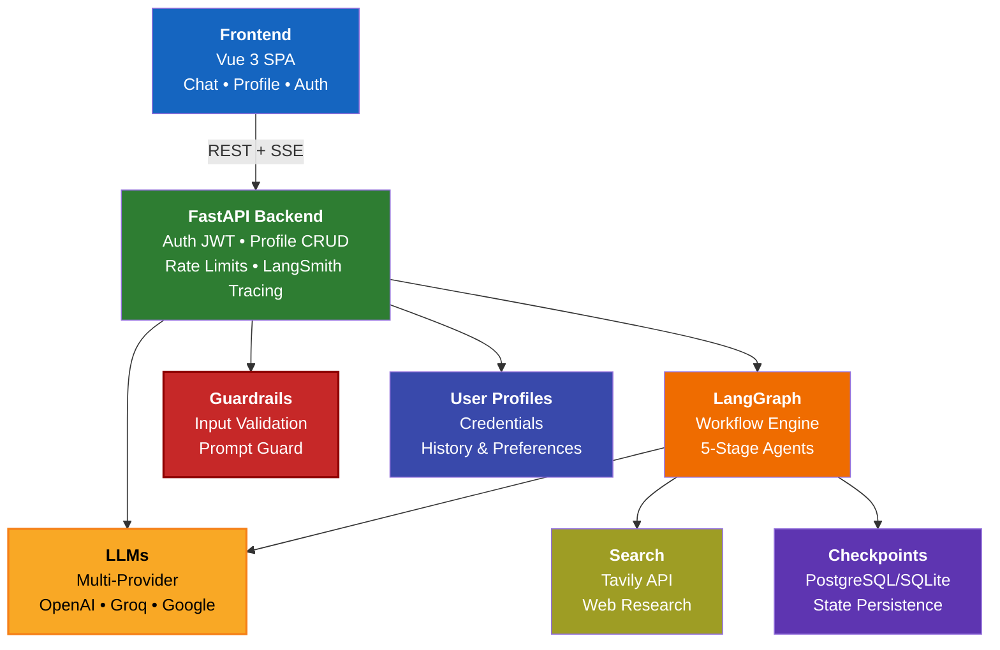
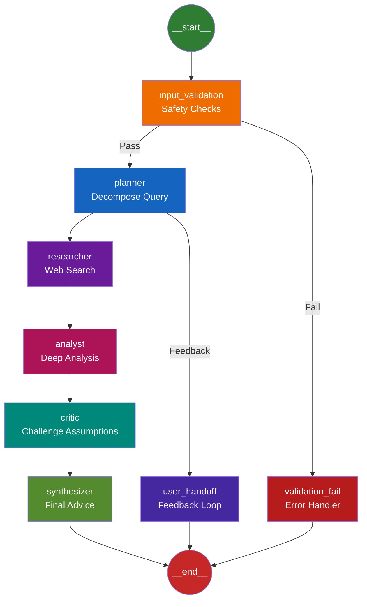
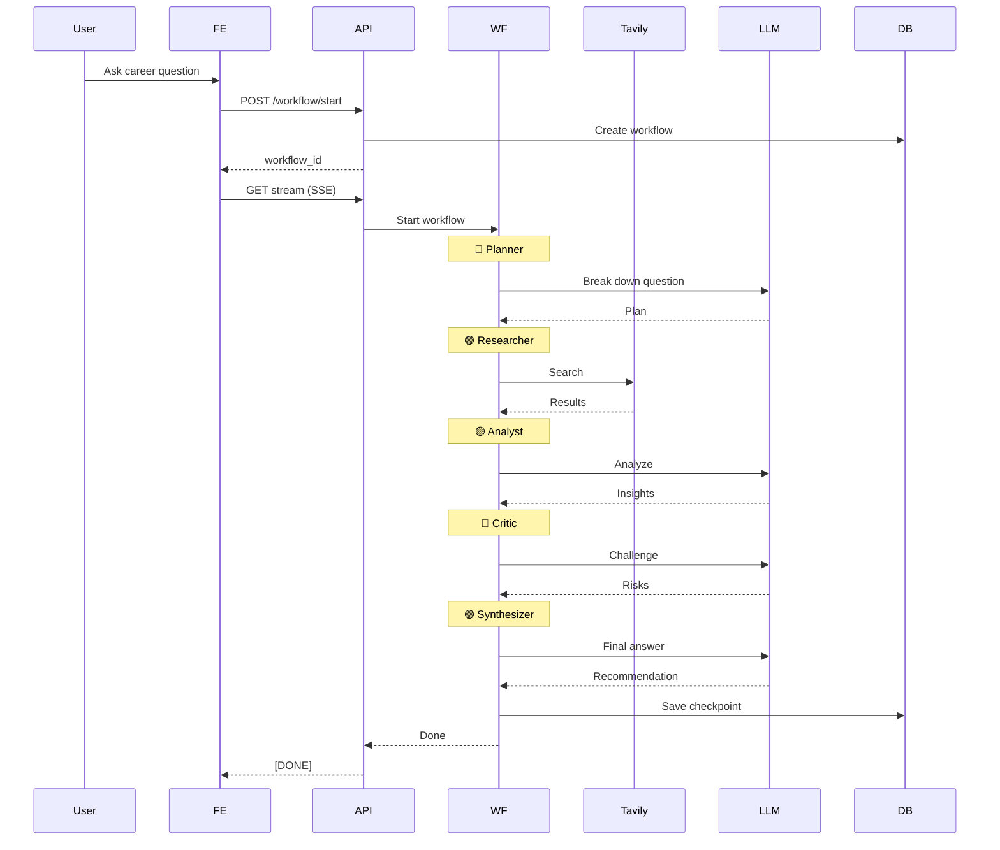
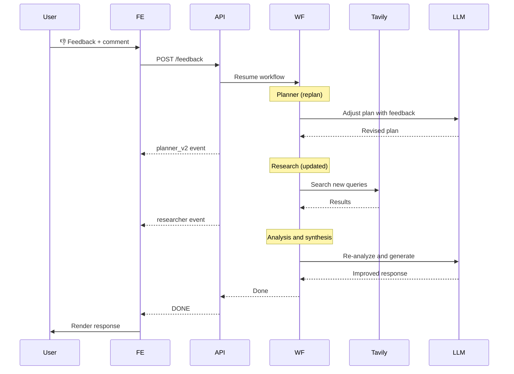

# Architecture

Career Copilot is built as a modular, scalable multi-tier system combining AI agents, persistent state, and secure API access.

## High-Level Overview



## Component Layers

### 1. Frontend Layer (Vue 3 SPA)

**Location:** `frontend/src/`

- **Chat Dashboard:** Real-time workflow streaming via SSE
- **Profile Management:** User data CRUD operations
- **Authentication:** JWT token handling, login/signup flows
- **State Management:** Pinia stores for UI state persistence

**Communication:** REST + SSE to FastAPI backend over HTTP/HTTPS.

See [Frontend README](frontend/README.md) for development details.

### 2. API Layer (FastAPI)

**Location:** `backend/app/api/`

Routes:
- `GET /` — API info
- `POST /auth/register`, `/auth/login` — User authentication
- `POST /verify-email`, `/resend-verification` — Account verification
- `POST /forgot-password`,`/reset-password` — Password reset
- `GET /health` — Health check for monitoring
- `GET /profile`, `PUT /profile` — User profile management
- `POST /workflow/start` — Initialize workflow
- `GET /workflow/{workflow_id}` — Stream workflow response via SSE

**Features:**
- Rate limiting (10 req/min per IP)
- Request/response logging
- JWT-based authentication
- Optional LangSmith tracing integration

### 3. Workflow Engine (LangGraph)

**Location:** `backend/app/graph/`

Multi-stage agent orchestration with feedback loops and error handling:



**Agent Nodes:**
- **Input Validation:** Safety checks and malicious prompt detection (Llama Prompt Guard)
- **Planner:** Decompose complex questions into focused research areas
- **Researcher:** Gather real-time information via Tavily and brave web search API
- **Analyst:** Deep-dive analysis of research findings
- **Critic:** Challenge assumptions, identify gaps, suggest improvements
- **Synthesizer:** Compile findings into actionable career advice
- **User Handoff:** Re-entry point for feedback loop (thumbs-down → replan)
- **Validation Fail:** Error handling for safety violations

**Checkpointing:** LangGraph persists workflow state at each stage (PostgreSQL/SQLite), allowing resumable conversations.

### 4. LLM Provider Layer

**Location:** `backend/app/llm/`

Supported providers:
- **OpenAI** (GPT-4o-mini default)
- **Groq** (LLaMA 3)
- **Google GenAI** (Gemini 2.5 flash etc)
- **OpenRouter** (multi-model gateway)

**Configuration:**
- Per-agent API keys
- Primary + fallback chain (automatic failover)
- Token usage tracking
- Custom system prompts per agent

### 5. Safety Layer (Guardrails)

**Location:** `backend/app/guardrails/`

- **Input Size Validation:** Prevents oversized prompts
- **Llama Prompt Guard 2:** Detects malicious/jailbreak attempts
  - Softmax probability threshold
  - Optional (`transformers-cpu` / `transformers-gpu` extras)

### 6. Persistence Layer

**Location:** `backend/app/db/`, `backend/database/`

**User Data (PostgreSQL/SQLite):**
- User profiles (credentials, preferences)
- Conversation history
- Workflow metadata
- Audit logs

**LangGraph Checkpoints (PostgreSQL/SQLite):**
- Workflow state snapshots
- Agent execution history
- Enables resumable conversations

**External Services:**
- **Tavily:** Web search API for research stage
- **Brave Search** Web search API for research stage
- **LangSmith:** LLM call tracing (optional)
---

## Data Flow Example

### User Asks a Career Question



### User Provides Feedback (Thumbs Down)


---

## Technology Stack Details

| Component | Technology | Why |
|-----------|-----------|-----|
| **Frontend** | Vue 3 + Vite | Fast HMR, ESM-native, modern TypeScript support |
| **Backend** | FastAPI | Async-native, auto OpenAPI docs, excellent performance |
| **Async Runtime** | asyncio (Python) | Lightweight, integrated with FastAPI |
| **Agents** | LangGraph | State management, checkpointing, multi-agent orchestration |
| **LLMs** | LangChain abstractions | Provider-agnostic, fallback chains, cost tracking |
| **Search** | Tavily API | Real-time web search, specialized for AI queries |
| **Security** | Llama Prompt Guard 2 | State-of-the-art jailbreak detection |
| **Database** | PostgreSQL (prod) / SQLite (dev) | ACID compliance, Alembic migrations |
| **ORM** | SQLAlchemy 2.0 | Declarative models, async support, type hints |
| **Container** | Docker (multi-stage) | Reproducible, optimized images, Spaces compatible |
| **Package Manager** | uv | Fast, deterministic lock files, native optional extras |

---

## Security Architecture

### Authentication & Authorization

```
Frontend (JWT token)
    │
    ├─ Stored in localStorage (XSS risk mitigated by frame sandbox)
    │
    └─ API (verify JWT signature)
        ├─ Extract user_id
        └─ Check permissions for resource
```

- **JWT Secret:** Stored in `.env`, never exposed
- **Password Hashing:** Argon2 (slow, memory-hard)
- **CORS:** Configurable, defaults to localhost:5173 for dev
- **Rate Limiting:** Prevents brute force + DDoS

### Input Validation & Sanitization

```
User Input
    │
    ├─ FastAPI Pydantic validation
    ├─ Size limits (max 1000 chars per prompt)
    ├─ Llama Prompt Guard 2 classification
    └─ Allow/Block decision
```

### LLM Safety

- **Guardrails:** Input filtering before LLM calls
- **Provider Selection:** Multi-provider option reduces single vendor lock-in
- **Tracing:** LangSmith logs all calls for audit
- **Output Filtering:** Basic regex patterns for sensitive data (optional)

---

## Deployment Topology

### Local Development

```
localhost:5173 (Vite dev server)
    ↓ (proxy /api)
localhost:8000 (FastAPI + uvicorn, reload enabled)
    ↓
SQLite (in-memory or file-based)
```

### Production (Cloud)

```
Hugging Face Spaces / Railway / Heroku
    │
    ├─ FastAPI app (containerized)
    ├─ PostgreSQL (managed DB service)
    ├─ Redis (caching, optional)
    └─ Environment secrets
        ├─ JWT_SECRET
        ├─ DATABASE_URL
        ├─ LLM API keys
        └─ TAVILY_API_KEY
```

---

## Scaling Considerations

### Current Bottlenecks

1. **LLM inference latency:** Multi-agent workflow inherently sequential
   - **Solution:** Parallel agent stages (future)

2. **Database writes:** Checkpoint on every stage
   - **Solution:** Batch writes, Redis caching

3. **Single API instance:** No horizontal scaling
   - **Solution:** Load balancer + multiple instances + PostgreSQL

### Future Optimizations

- Caching layer (Redis) for repeated queries
- Async agent branches (parallel researcher + analyst)
- User query deduplication
- Token usage optimization (prompt caching)
- Distributed tracing across services

---

## Observability & Monitoring

### Logging

- **Application logs:** `backend/logs/app.log`
- **Request logs:** `backend/logs/requests.log`
- **Levels:** INFO (default), DEBUG (dev), ERROR

### Tracing

- **LangSmith integration:** Optional, opt-in via `LANGSMITH_API_KEY`
- **Traces include:** Agent decisions, LLM calls, token counts

### Health Checks

```
GET /health
→ {"status": "ok", "db": "connected", "timestamp": "..."}
```

Useful for load balancers and monitoring services.

---

## References

- LangGraph Docs: https://langchain-ai.github.io/langgraph/
- FastAPI Docs: https://fastapi.tiangolo.com/
- SQLAlchemy Async: https://docs.sqlalchemy.org/en/20/orm/extensions/asyncio.html
